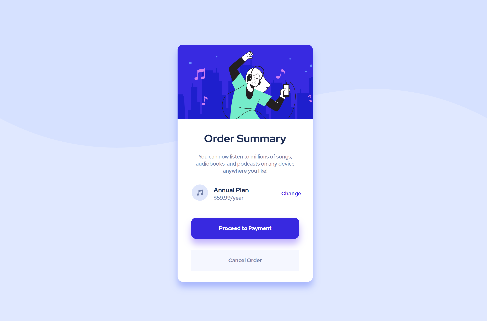

 Frontend Mentor - Order summary card solution

## Table of contents

- [Overview](#overview)
  - [The challenge](#the-challenge)
  - [Screenshot](#screenshot)
  - [Links](#links)
  - [Built with](#built-with)
  - [What I learned](#what-i-learned)
- [Author](#author)

## Overview
This is a solution to the [Order summary card challenge on Frontend Mentor](https://www.frontendmentor.io/challenges/order-summary-component-QlPmajDUj).  

### The challenge

Users should be able to:

- See hover states for interactive elements

### Screenshot

### Links

- Solution URL: [https://github.com/NandodkarAmogh/Order-summary-component](https://github.com/NandodkarAmogh/Order-summary-component)
- Live Site URL: [https://css-order-summary-component.netlify.app/](https://css-order-summary-component.netlify.app/)

### Built with

- Semantic HTML5 markup
- CSS custom properties
- Flexbox
- Mobile-first workflow

### What I learned
This project helped me to improvise my skills in css properties and flexbox.

## Author

- Website - [Amogh Nandodkar](https://amoghnandodkar.netlify.app/)
- Frontend Mentor - [@NandodkarAmogh](https://www.frontendmentor.io/profile/NandodkarAmogh
